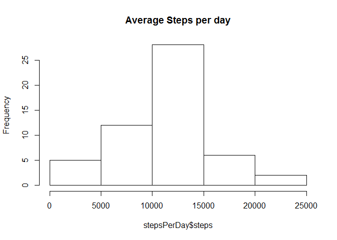
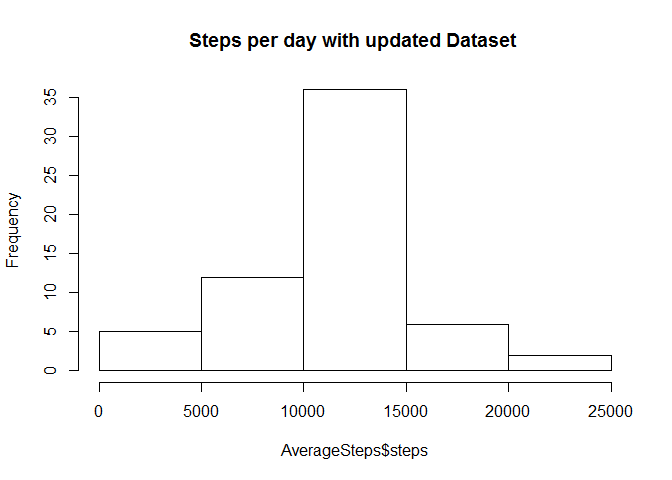

# Reproducible Research: Peer Assessment 1
Ashwin Pingali  

## Loading and preprocessing the data
Before begining the analysis we need to unzip the data file activity.zip. I have forked the assignment into a local directory and have created this as a the local repository for GITHUB. 
We will set the working directory to this local repository. We will then use the unzip command to unzip the activity.zip file which is in this local directory.
We will list the files in the directory to ensure that there is a file called activity.csv in the working directory.


```r
setwd("~/GitHub/Reproduceable-Research/RepData_PeerAssessment1")
unzip("activity.zip")
list.files(pattern="*.csv")
```

```
## [1] "activity.csv"
```

We will load the data in the file into a dataframe called Activity.
We will then use the head command to review the data in the dataframe. We will also create a new dataframe that only looks at rows that don't have missing data


```r
Activity <- read.csv("activity.csv",header=TRUE,na.strings="NA")
stepsPerDay <- aggregate(steps ~ date, data = Activity, sum, na.rm = TRUE)
head(stepsPerDay)
```

```
##         date steps
## 1 2012-10-02   126
## 2 2012-10-03 11352
## 3 2012-10-04 12116
## 4 2012-10-05 13294
## 5 2012-10-06 15420
## 6 2012-10-07 11015
```


We now have the data all stored in the dataframe ready to process.
Before we begin the analysis we wil install some packages and then load the package data.table and the package dplyr


```r
library(data.table)
library(plyr)
```

## What is mean total number of steps taken per day?


```r
hist(stepsPerDay$steps,main="Average Steps per day")
```

 

```r
MeanSteps <- mean(stepsPerDay$steps)
MedianSteps<- median(stepsPerDay$steps)
```

Mean Steps = 10766.19
Median Steps = 10765


## What is the average daily activity pattern?
For this plot we will use the aggregate function and the plot function. The x axis will be a five minute time interval and the y-axis would be the average number of steps


```r
timePlot <- aggregate(steps ~ interval, data = Activity, mean, na.rm = TRUE)
plot(steps ~ interval, data = timePlot, type = "l")
```

 

### Five minute interval with the maximum number of steps


```r
timePlot[which.max(timePlot$steps), ]$interval 
```

```
## [1] 835
```

```r
# 835 steps
```

## Imputing missing values

Number of missing values in the Activity Data set

```r
sum(is.na(Activity$steps))
```

```
## [1] 2304
```

```r
# Function for filling in the missing values
MissingValuesImpute <- function(interval) {
    timePlot[timePlot$interval == interval, ]$steps
}

updateActivity <- Activity  # Duplicating the existing Activity dataframe
count = 0  # Initializing the count variable
head(updateActivity)
```

```
##   steps       date interval
## 1    NA 2012-10-01        0
## 2    NA 2012-10-01        5
## 3    NA 2012-10-01       10
## 4    NA 2012-10-01       15
## 5    NA 2012-10-01       20
## 6    NA 2012-10-01       25
```

```r
for (i in 1:nrow(updateActivity))
  {
    if (is.na(updateActivity[i, ]$steps)) {
        updateActivity[i, ]$steps <- MissingValuesImpute(updateActivity[i, ]$interval)
        count = count + 1
    }
}
head(updateActivity)
```

```
##       steps       date interval
## 1 1.7169811 2012-10-01        0
## 2 0.3396226 2012-10-01        5
## 3 0.1320755 2012-10-01       10
## 4 0.1509434 2012-10-01       15
## 5 0.0754717 2012-10-01       20
## 6 2.0943396 2012-10-01       25
```

```r
cat("Total", count, "NA values were substituted.\n\r")
```

```
## Total 2304 NA values were substituted.
## 
```

*Make a histogram of the total number of steps taken each day and Calculate and report the mean and median total number of steps taken per day. Do these values differ from the estimates from the first part of the assignment? What is the impact of imputing missing data on the estimates of the total daily number of steps?


```r
AverageSteps <- aggregate(steps ~ date, data = updateActivity, sum)
hist(AverageSteps$steps,main="Steps per day with updated Dataset ")
```

 

```r
cat("The mean number of steps taken per day is ", mean(AverageSteps$steps))
```

```
## The mean number of steps taken per day is  10766.19
```

```r
cat("The median number of steps taken per day is ", mean(AverageSteps$steps))
```

```
## The median number of steps taken per day is  10766.19
```

There seems to be no difference in the average but there is a slight difference in the median.


## Are there differences in activity patterns between weekdays and weekends?

For this part the weekdays() function may be of some help here. Use the dataset with the filled-in missing values for this part.

1.Create a new factor variable in the dataset with two levels - "weekday" and "weekend" indicating whether a given date is a weekday or weekend day.


2.Make a panel plot containing a time series plot (i.e. type = "l") of the 5-minute interval (x-axis) and the average number of steps taken, averaged across all weekday days or weekend days (y-axis). See the README file in the GitHub repository to see an example of what this plot should look like using simulated data.


